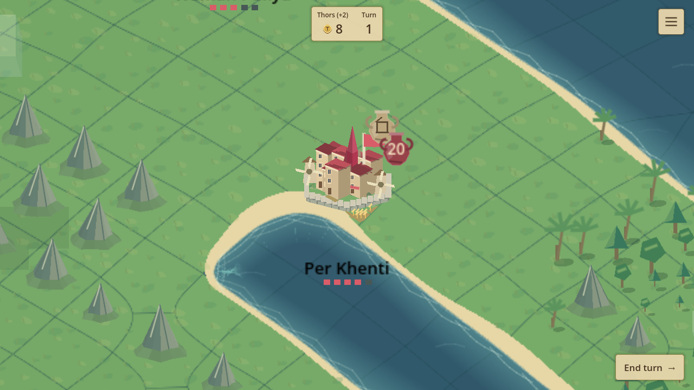
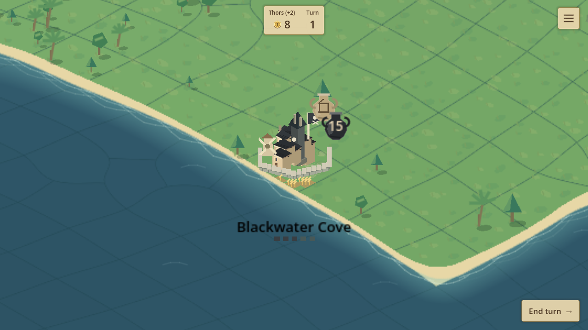
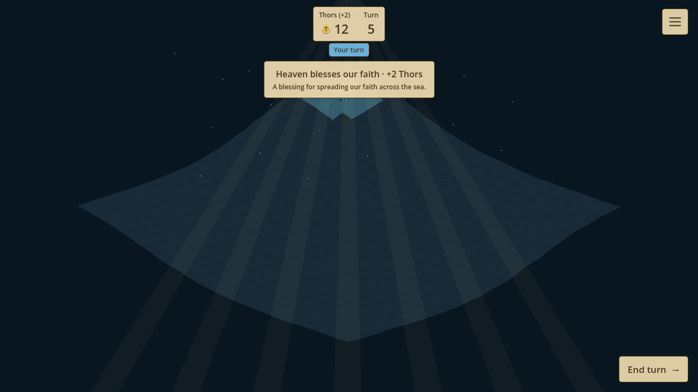

# Ancient Naval v0.20.2 — Bays and Blessings

2 October 2026. This user-requested version identifier follows the completed local 0.21 checkpoint. The authoritative sources, Windows package, source archive and mirrored local launch copy retain all 0.21 salvos, encounter rewards, cameras, banners, towns, ports and saves.

## Implemented

- New-world fish budget reduced by approximately 30%, with one guaranteed near-home catch per fleet. Central weighted sampling favors contested waters. Pangaea retains an interior fish majority when sufficient sites exist. Three coastal towns per territory keep local access and concentrate the other sites centrally. Neutral towns have small chances of level 2 or 3; at least two level-3 fortified pirate bays are guaranteed and use the black palette.
- Mothership progression now costs 3 / 4 / 5 / 6 resources. Existing level currency rewards and selectable upgrades remain intact.
- Player receives 2 Thors per living owned town plus living Mothership at every fifth personal turn start. Each rival receives 2 Thors per direct enemy Mothership destruction on its own fifth-turn cadence. Pirates receive no heavenly aid. Collapse scuttling does not add kills. Payments count toward positive lifetime income and persist through staged snapshots and Continue, without double payment.
- A top-centered heavenly plaque, light rays and sparks announce committed payments. Unknown rival aid hides captain, amount and kill count. The finite overlay ignores input and never invalidates terrain caches.
- Brig and Fishing Schooner leave no radar contacts. Real optical sight still reveals them. Actual mountain-cell polygons shadow lookouts and town sight; radar and airborne lookouts bypass mountain occlusion.
- Shared deterministic terrain features place sparse groves and true plains; ridges follow island component geometry and keep a full land-cell buffer from water. Peaks have folded faces and irregular inset green skirts. Slightly darker coast-depth bands apply to land and sea.
- Variable beaches fill the blue cutouts within rounded coastal land cells. Village soil consists of irregular clipped patches rather than a rectangular slab. Wheat moves nearer houses; fortified walls sit between fields and homes. Native half-plane decomposition removes beach holes safely, with a quarter-pixel anti-bleed margin. Church/monument height increases by level; pirate bays have a charcoal tower and roofs. Flags remain attached to their poles.
- Six expanded pools contain 24 captains and 32 towns per color, plus 24 pirate town names. All labels use Latin letters. New game color selection rethemes the initial territories; captured or resumed worlds retain their identities. Historical name pools remain valid for old saves.

## Executed validation

| Check | Result |
|---|---|
| C# build | 0 warnings, 0 errors |
| Exported Windows title / map startup | Exit 0 / exit 0; no error logs |
| Entire pure .NET suite | 1,202,283 checks; eight complete AI matches |
| New rules / world / culture checks included above | 31 / 545 / 133 |
| Native terrain, clipped towns, beaches, flags and retained atlases | 2,325 |
| Native heavenly payment, privacy, plaque and light | 7 |
| Existing salvo, lower fans, camera duration, pointer and nation privacy | 141 |
| Six-color town/fleet art; claim/treasury ceremony | 48 / 46 |
| Four world modes and Continue; rare Pangaea geometry regression | 110 / 25,587 |
| Oceans geometry and cache reuse at 1–4 rivals | 61,447 |
| Fleet art, clay HP and anonymous mortar kill | 666 |
| Victory / ports / effects / income animation | 107 / 12 / 121 / 6 |
| Menu / separate-process Continue / battle interaction | 142 / 120 / 83 |
| Mouse, touch, camera smoke / sea events / retained renderer | 248,659 / 108 / 11 |

Native graphical checks use Godot 4.7.2 .NET on the installed renderer, with disposable save slots. Release templates disable the test hooks; exported title and map startup are checked separately. Historical fixtures were updated where fish counts, name catalog sizes or deliberately hidden radar hulls changed; their privacy and preservation assertions remain.

## Performance and limits

A 1,371-cell Oceans map with four rivals and live fog measured pan p95 19.369 ms, hover p95 0.094 ms and frame p95 18.231 ms. One move/encounter frame reached 80.757 ms. A fully opened Pangaea chart measured pan p95 38.630 ms and a 149.698 ms maximum interaction frame. These are native debug measurements on this host (window not focused), not guarantees of constant frame rate. Terrain and scenery caches remain retained during pan/selection; movement contours and navigation previews are rebuilt only when their gameplay state changes. Logs are in [diagnostics](diagnostics/0.20.2/).

The outer tips of sand corner fills can be more angular than the smooth main shore. Small Sea World islets deliberately have no mountain if they cannot contain the required land buffer.

## Compatibility and playing

Start **New game** for the new progression, stealth, mountain shadows and heavenly aid. **Continue** retains the saved rules, resources, currency and names. New optional rules default to historical behavior when missing. Terrain scenery reconstructs deterministically from saved board geometry. Heavenly counters are optional validated arrays and are saved after their single committed transition.

Extract the complete Windows ZIP and run `Ancient Naval.exe`; keep its PCK and .NET runtime alongside it. Godot development: open the source archive's `project.godot`, stop an old run with F8 and run with F5. The external outputs and repository `releases/0.20.2/` copies have SHA256 manifests; all older checkpoint archives remain intact.

